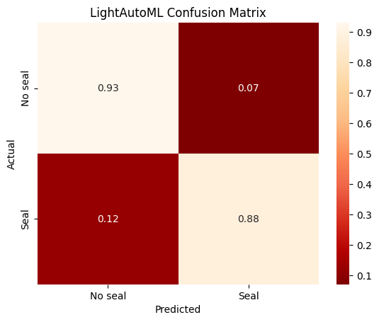

# <b>Search for images with and without seagulls</b>

### <b>Link to download train dataset: https://drive.google.com/file/d/1luLSvOSzzafJh30X5YODHX86lcZSbFyj/view</b>

# Used technology stack:

# Best Result (LightAutoML):
|                  | **precision** | **recall** | **f1-score** | **support** |
| ---------------- | ------------- | ---------- | ------------ | ----------- |
| **NO SEAL**      | 0.93          | 0.80       | 0.86         | 108         |
| **SEAL**         | 0.88          | 0.96       | 0.92         | 165         |
|                  |               |            |              |             |
| **accuracy**     |               |            | 0.90         | 273         |
| **macro avg**    | 0.91          | 0.88       | 0.89         | 273         |
| **weighted**     | 0.90          | 0.90       | 0.90         | 273         |

